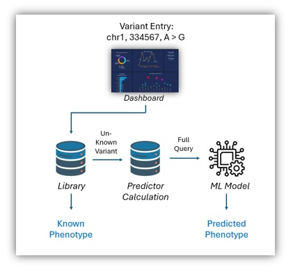
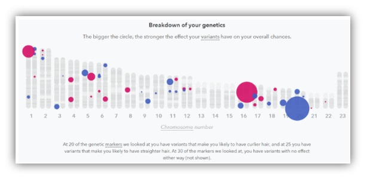
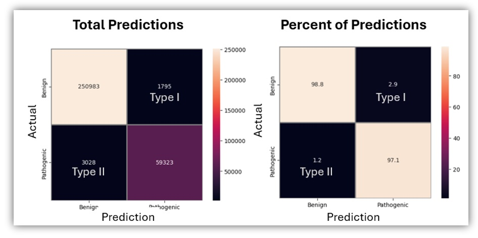
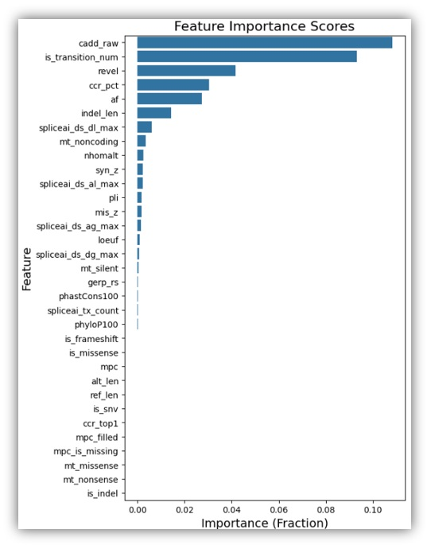
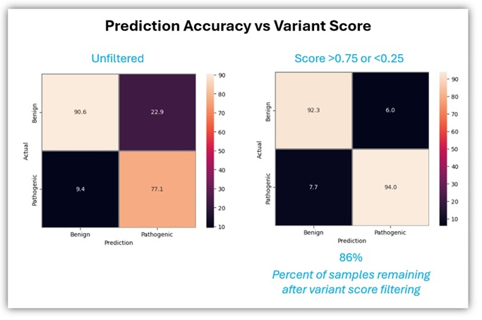
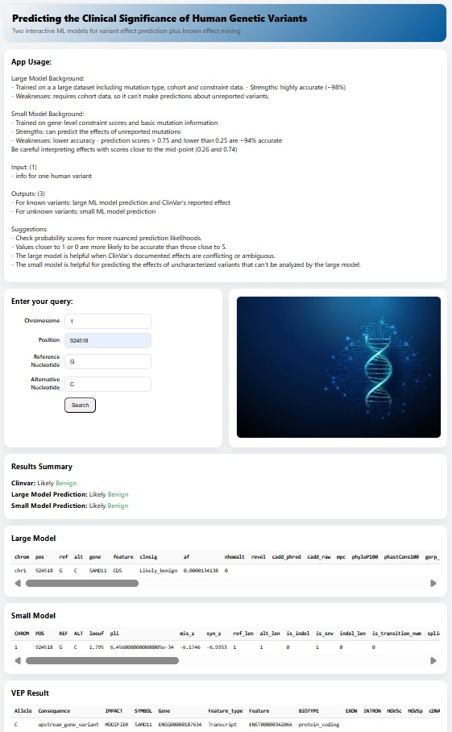

# ML Project: Predicting Variant Pathogenicity
<i>Using only basic info, the model predicts if a SNP is pathogenic or benign with high confidence </i>

## Highlights:
### Two ML Models:
- Two histogram-based gradient boosting classification models that predict variant effects
- Model 1: predicts the effect of mutations for which cohort data is available (Accuracy: ~98%)
- Model 2: predicts effects for uncharacterized mutants (Accuracy: ~93%)
### Predictions:
- predicted effects of ~2M variants with ambiguous/conflicting reports in ClinVar

### Online Tool:
- Interactive Plotly dashboard for ML model predictions

## Input/Output Example:
- Input: chr1, position 331523, A>G
- Outputs: variant data (conservation, type of mutation, etc.) and predicted effect (benign or pathogenic)

## Rationale
Not all genetic variants are understood. This leaves a gap in our knowledgebase that could be filled via predictive modelling. This ML model is intended to fill that gap by making highly accurate predictions about previously uncharacterized mutations.

<b>For Biologists: </b> Inferred effects can be helpful for research, especially when accompanied by supporting data.

<b>For the Public:</b> Many of us are interested in understanding our own genetics, often paying to have our own genomes commercially sequenced. However understanding the results of whole-genome sequencing can be a challenge due to the potential for unique variants to arise. Companies like 23AndMe provide information about known variants. However, rare or unique variants may have little to no data to support an interpretation, leaving patients in the dark. 

## Prediction overview
A user first enters any mutation (chrom, pos, ref, alt) into the model using a GUI or Python script. The script looks up the variant in the existing database (pre-compiled) to see if clinical information has already been established for that mutation. If so, the effect is reported. If not, the Python script looks uses the entry to look up/calculate the additional features needed as input for the model. The model then predicts the clinical effect of the variant(s). Note: the ML portion of this pipeline is complete, and intended to be a proof-of-concept. Additional features are planned for the future. 

## Training library creation
I wanted the training data to be as comprehensive as possible to ensure that the resulting model has a high level of accurcy. However, I also wanted to create a generally useful model where basic variant information (chromosome/position/ref/alt allele) would be sufficient to make predictions. As these goals are mutually exclusive, I built two sets of training data and two models. 

I instantiated the large training database using the full ClinVar [dataset]([https://ftp.ncbi.nlm.nih.gov/pub/clinvar/vcf_GRCh38/clinvar.vcf.gz.tbi), available on NCBI's website and split multiallelic entries into separate lines using bcftools. To ensure proper variant coordinate calling, I "left-aligned" the dataset. This shifts the start position of a variant to their left-most location, potentially normalizing/fixing issues wiht indel coordinate calling and allowing for consistent variant identification across databases. From this starting point, I added annotations from other databases. 

Next, I downloaded the [Gnomad](https://gnomad.broadinstitute.org/) genome and exome databases which are quite large. Gnomad exome has data from far more individuals (730,000), but fewer variants (~180 million) because the data are limited to exons. Gnomad genome, has only 1/10th the number of genoems (76,000) but far more variants overall (~760,000,000) due to the significanly higher number of nucleotides per individual. As the genomic data include variants in intronic and other non-coding sequences, the two databases have both disparate and overlapping data. To mine these datasets, I used the bcftools <i>annotate</i> function which matches variants in the Gnomad data to my own dataset (initially just ClinVar) using the chromosome name, position, reference allele, and alternative allele. The Gnomad annotations provided variant allele count, frequency, and the total allele count (size of the full per-allele dataset). I also collected the <b>"nhomalt"</b> metric which is the number/frequency of homozygous-alternative individuals, an extremely informative metric. To prevent duplicating or misannotating records, I left-aligned and normalized the combined dataset which identifies and removes duplicates. 

I also anticipated that <b>gene-level</b> data would also be helpful for predicting clinical outcomes by providing information about the general tolerance of whole regions to genetic alteration. Accordingly, I downloaded [gene-level](https://gnomad-public.us-east-1/release/4.1/constraint/gnomad.v4.1.constraint_metrics.tsv) data from Gnomad including constraint scores such as <b>LOEUF, pLI, missense intolerance, and synonymous mutation tolerance</b>. I added them to the training data by converting the gtf-formatted data to a .bed file, and and annotating using bcftools' <i>annotate</i> function. 

Next I added data from <b>dbNSFP</b> - an excellent [database](https://genomemedicine.biomedcentral.com/articles/10.1186/s13073-020-00803-9) with pre-compiled information from a variety of sources including <b>CADD, REVEL, SpliceAI, MPC</b>. Lacking an academic email address, I was forced to download an older copy of the database which lacks <b>SpliceAI</b> data. This necessitated additional, separate downloads and matching of the SpliceAI's SNV data from [Ensemble]( https://ftp.ensembl.org/pub/data_files/homo_sapiens/GRCh38/variation_plugins/spliceai_scores.masked.snv.ensembl_mane.grch38.110.vcf.gz) and [indel data](https://molgenis26.gcc.rug.nl/downloads/vip/resources/GRCh38/spliceai_scores.masked.indel.hg38.vcf.gz) from a community server. I also downloaded <b>regional intolerance data</b> (CCR) including both [autosomes](https://ccrs.s3.us-east-2.amazonaws.com/ccrs/ccrs.autosomes.v2.20180420.bed.gz) and the [X](https://ccrs.s3.us-east-2.amazonaws.com/ccrs/ccrs.xchrom.v2.20180420.bed.gz) chromosome (though no Y-chromosome data). These datasets provided quantitative measurements about variants within coding intervals that are unusually depleted of any non-synonymous changes in large human cohorts. Last I incorporated [transcript-level variant effect predictions](https://ftp.ensembl.org/pub/current_gff3/homo_sapiens/Homo_sapiens.GRCh38.115.chr.gff3.gz)] from <b>Ensemble</b>. At this point, the data were ready for cleanup. 

## Data cleanup and imputation
After exporting my final annotated .vcf file to .tsv, there were a number of issues with data formatting. Specifically, disparate data fields form SpliceAI were combined into a single pipe-delimted string. Similarly, mutation type and conservation were all packed into a single entry like: "missense|OR4F5|ENST00000641515|protein_coding|+|36E>36G|69134A>G". Fortunately, unpacking these columns in Python was trivial and the resulting data file was ready for import into a Pandas data frame. 

Data field engineering steps included one-hot encoding of mutation type: from a column of factors like "missense"/"non-coding"/"synonymous" dummy columns were produced, one per factor, with a 0 or 1 values. Target classes were filtered down to "benign" or "pathogenic" classifications. In other words, target entries listed as "conflicting effect" were removed. At that point, the initial data fields (chrom, pos, ref, and alt) were temporarily removed as they are not directly informative, and only used to collect the other predictor columns. 

## Training data columns
<i>After removing collinear feature columns, the final training data contained 3,674,815 variants and 34 features.</i>

|Field|Database of origin|Short description|
|:-------|:------|:------|
|label|Derived (ClinVar)|The model target. 1 = Pathogenic; 0 = Benign.|
|alt_len|Derived (REF/ALT)|Length of ALT allele.|
|cadd_raw|dbNSFP (CADD)|Variant deleteriousness raw score|
|ccr_pct|CCR (Constrained Coding Regions)|Coding constraint at position as percentile (0–100).|
|gerp_rs|dbNSFP (GERP++)|Substitution rejection level (higher = more constrained).|
|indel_len|Derived (REF/ALT)|abs(len(ALT) − len(REF)).|
|is_indel|Derived (REF/ALT)|1 if not a single-base change; else 0.|
|is_snv|Derived (REF/ALT)|1 if single-nucleotide variant; else 0.|
|is_transition_num|Derived (REF/ALT)|SNVs: 1=transition, 0=transversion; −1 if not applicable.|
|is_frameshift|Derived (BCSQ/CSQ)|Consequence is frameshift; 1 or 0.|
|is_missense|Derived (BCSQ/CSQ)|1 if any transcript consequence is missense; else 0.|
|loeuf|gnomAD constraint (by gene)|Loss-of-function tolerance. Lower = more intolerant|
|mis_z|gnomAD constraint (by gene)|Missense depletion Z-score (higher = more constrained).|
|mpc|dbNSFP (MPC)|Scores the "badness" of missense SNVs|
|mpc_filled|Derived (MPC + missense flag)|MPC where applicable; −1 sentinel when not missense.|
|mpc_is_missing|Derived|1 if MPC is missing among missense rows; else 0.|
|mt_missense|Derived (one-hot)|One-hot: missense.|
|mt_noncoding|Derived (one-hot)|One-hot: noncoding.|
|mt_nonsense|Derived (one-hot)|One-hot: nonsense/stop-gained.|
|mt_silent|Derived (one-hot)|One-hot: synonymous/silent.|
|nhomalt|gnomAD (exomes/genomes)|Number of homozygous-ALT individuals at the site.|
|phyloP100|dbNSFP (phyloP)|Conservation level (higher = more conserved).|
|phastCons100|dbNSFP (phastCons)|100-way conservation probability (0–1).|
|pli|gnomAD constraint (by gene)|Probability of LoF intolerance (0–1; higher = more intolerant).|
|ref_len|Derived (REF/ALT)|Length of REF allele.|
|revel|dbNSFP (REVEL)|REVEL pathogenicity score (0–1) for missense SNVs.|
|spliceai_tx_count|Derived (SpliceAI INFO)|Number of transcript records parsed from SpliceAI string.|
|spliceai_ds_ag_max|SpliceAI precomputed VCF|Max ΔScore (0–1) for acceptor-gain across transcripts.|
|spliceai_ds_al_max|SpliceAI precomputed VCF|Max ΔScore for acceptor-loss.|
|spliceai_ds_dg_max|SpliceAI precomputed VCF|Max ΔScore for donor-gain.|
|spliceai_ds_dl_max|SpliceAI precomputed VCF|Max ΔScore for donor-loss.|
|syn_z|gnomAD constraint (by gene)|Synonymous Z-score (near 0 typically; control metric).|
 

### Training data samples
|Metric|Number of Variants|Percent|
|:-----|:-----|:-----|
|Total Variants|3,674,809||
|Variants with Ambiguous Effect|2,099,378|57% of total|
|Variants with Clear Effect|1,575,431|42% of total|
|Pathogenic Variants|311,599|19% of clear variants|
|Benign Variants|1,263,832|80% of clear variants|

## Model Scoring
Given the richness of the training data, it is perhaps not surprising that the initial training produced a highly accurate model with an overall precision scores of 0.985 for both recall and precision. I observed a rate of 2.9% for Type I errors and 2.9% for Type II errors. See my [Jupyter notebook](./jupyter_notebooks/model.ipynb) for the actual code.  

 

To investigate the most useful features, I used scikit-learn's permutation_importance module. This demonstrated that the CADD raw score (variant deleteriousness) was the top predictor, followed by the characterization of SNPs as transitions/transversions/other. Perhaps not surprisingly, REVEL score (pathogenicity) was also a top predictor.  

During my first training, I noticed that indel detection came in last in terms of feature importance. This was explained by the fact that indel length is highly rankek - i.e. the two are collinear. Similarly, ccr_top1 was not useful for the same reason. In subsequent training rounds these columns were removed. (Resulting in the high accuracy score reported above.) 

## Real-World Use Case:
The NCBI ClinVar data consists of 3.6M records of which two thirds (over 2M records) have ambiguous clinical significance. I propose that inferring their effects via ML could be valuable. Therefore, after training the model on the 1.5M high-confidence samples, I used my large model to predict the effect of those variants. [Jupyter notebook](./jupyter_notebooks/model.ipynb). After filtering the results to variants with high confidence scores (thereby yielding an expected accuracy of 93%) 1,950,978 variants remained. Among themn, roughly 25% (539k) are predicted to be pathogenic - a staggering number that exceeds the number of ClinVar's clearly defined pathogenic variants (311k). Among the remaining variants, 1,411,452 are predicted to be benign and 148,400 are of indeterminate effect. 

## A second model for uncharacterized variants
While the first model is accurate, it requires cohort data as input. As such, it can only predict the effect of variants that have been previously observed in many people. Therefore, an additioinal model is needed for previously unidentified variants.

To create a model capable of predicting the effect of any variant (including previously unseen variants) based solely off of the CHR, POS, REF, and ALT inputs, (what a patient might see on a genetic test) I reduced the training data to fields that can be derived from those inputs. These are: 

|Predictor|Source|Description| 
|:-----|:-----|:-----|
|loeuf|gnomAD constraint|Gene-level loss-of-function tolerance. Lower = more intolerant|
|pli|gnomAD constraint|Gene-level probability of LoF intolerance |
|mis_z|gnomAD constraint|Gene-level missense depletion Z-score |
|syn_z|gnomAD constraint|Gene-level synonymous Z-score |
|ref_len|Derived|Reference Length|
|alt_len|Derived|Alt. Length|
|indel_len|Derived|Indel Length|
|is_indel|Derived|One-hot: Indel|
|is_snv|Derived|One-hot: single-base change|
|is_transition_num|Derived|One-hot: transition/transversion|
|is_frameshift|Derived|One-hot: frameshift|
|mt_missense|Derived|One-hot: missense|
|mt_noncoding|Derived|One-hot: noncoding|
|mt_nonsense|Derived|One-hot: nonsense/stop-gained|
|mt_silent|Derived|One-hot: synonymous/silent|
|spliceai_tx_count|SpliceAI Calculation|Number of transcript records parsed from SpliceAI string|
|spliceai_ds_ag_max|SpliceAI Calculation|Max ΔScore (0–1) for acceptor-gain across transcripts|
|spliceai_ds_al_max|SpliceAI Calculation|Max ΔScore for acceptor-loss|
|spliceai_ds_dg_max|SpliceAI Calculation|Max ΔScore for donor-gain|
|spliceai_ds_dl_max|SpliceAI Calculation|Max ΔScore for donor-loss|

This second model, trained on the reduced dataset, trades a reduction in accuracy for broader predictive ability. Given the vast size of the human genome and subtlety of individual changes, creating such a usful model with limited input data is challenging. Nevertheless, it is worth attempting simply because the model should provide users with a potentially helpful guess about potential pathogenicity of variants along with useful technical data supporting the conclusion (e.g. the type of mutation, effect on splicing, etc.)

To test the accuracy of this general model, I performed 5-fold cross validation. In accordance with the dramatically reduced level of input information, the reduced model still has a reasonably high level of accuracy: 0.87 precision and 0.88 recall scores. However, the confusion matrix demonstrates that false positives are a major issue (23%). To reduce this issue, I filtered the results down to high-confidence probability scores by filtering to scores >0.75 or <0.25. Remaining datapoints are labeled as "ambiguous". Approximately 86% of the data fall into the high confidence category. Among these datapoints, the model predicts the correct effect ~93% of the time. For a model based on such limited data, the score seems reasonable. 

## Conclusions
This model building project is intended to showcase my ability to a) mine a variety of publicly available resources, b) build a rich training dataset, and c) construct useful machine learning models. I also hoped the my model would produce results that are interesting and useful, not just for biologists, but for the general public as well - vis a vis predictions about ambiguous mutations and those that have never been observed before.

My large model which uses cohort data to predict pathogenicity has an high level of accuracy (~98%). The second, smaller model, is able to predict the effect of a broader array of variants, including those that have never been identified in patients. While this model necessarily has lower accuracy, it achieved a surprisingly high model score at 93%, and works for roughly 86% of variants. It may be useful as a research tool.

# Online tool creation
I am currently building a Plotly dashboard takes the user-given variant information and uses it to query the library of known mutations (ambiguous and non-ambiguous), and to make variant effect predictions using the small model. 

General procedure:  
- Input is one variant's information - CHROM, POS, REF, ALT 
- Output A: If the variant is known, all information for that variant is reported along with ClinVar's Clinical Significance data. 
- Outupt B: If the variant is not known, the app will use VEP to make mulitple calculations about the mutation such as the effect on splicing (with SpliceAI), if the mutation is a transition/transversion, indel, or SNP, etc. This will populate the data fields needed for effect prediction by the small/general/low-res model which will report "Likely Benign" or "Likely Pathogenic".

Current draft of my Plotly dashboard :)  

